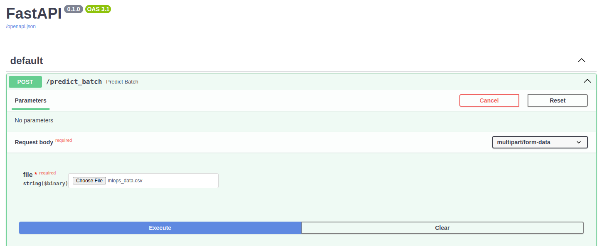
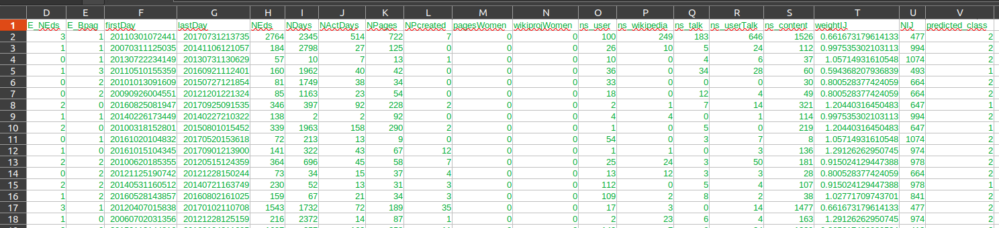
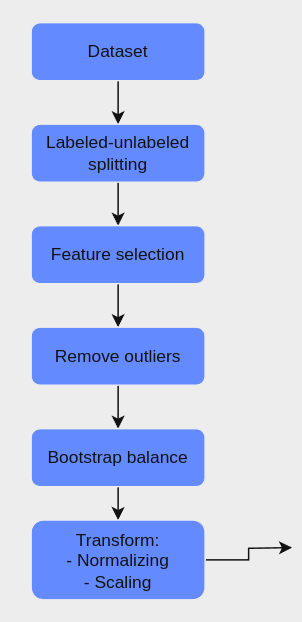
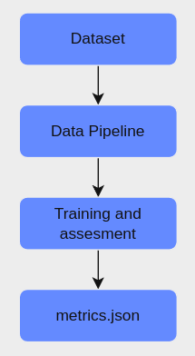
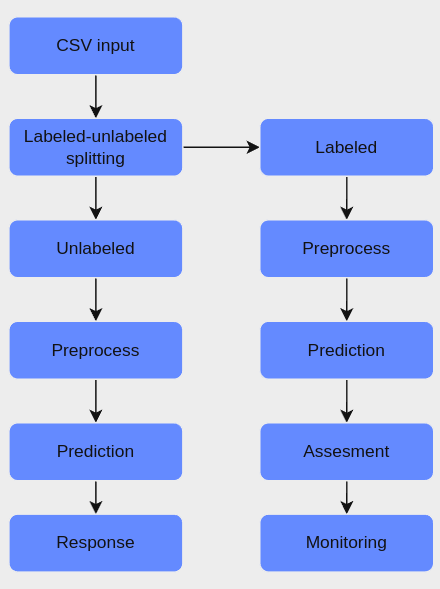

# Wikipedia Gender Gap ML Implementation
This repo is intended to demonstrate what was learnt in the MLOps Bootcamp initiative from Wizeline and Coecytjal.

## Repo's Objective
 - Wikipedia editors are prominently males, but the uncertainty of the actual number of males and females is a big problem for any attempt to reduce this gap
 - A good solution to this problem is to train an ML Model to classify editors based on information collected.
 - This project has been developed with the MLOps mindset, so the implementation can be deployed and maintain for its constant usage.

## Data
The data used to train and test the model is available here: https://archive.ics.uci.edu/dataset/852/gender+gap+in+spanish+wp

## Building model and preprocessor

The app needs two serialized objects to work propperly. One is the model and the other is the preprocessor.

Running the training pipeline will create and write both at the models directory

### Run the training pipeline

Set the virtual environment and install packages

```bash
 python -m venv .venv
 source .venv/bin/activate
 pip install -r requirements.txt
``` 

Run the pipeline
```bash
 python3 -m src.pipeline.training_pipeline
``` 

This will write the objects at the app too, so they can be immediately used.

NOTE: Make sure you have the corresponding csv file at the repository. The relative location of this file should be at the settings.json file 

This same process would be enough to retrain the model everytime you need

## Running the App

To build the Docker image make sure you're at the app directory
```bash
cd app
``` 
then build the image:
```bash
docker build --tag ml_model_img .
``` 
To run the instance:
```bash
docker run --name ml_app --rm --publish 8000:8000 ml_model_img
```


To try out the model for inferences, open your browser at [localhost:8000/docs](localhost:8000/docs). You should see the API documentation interface, provided by Fast API.

Click on the **Try it out** button and enter the input file to get a model inference.



The response will be a csv file with the corresponding inference at the column named 'predicted_class'



## Monitoring

At the docker container's log you would be able to see the current scoring of the model calculated with the data that has been just ingested by the API endpoint.

## Workflows and pipelines

### Data pipeline
Data is processed in the next way:



### Training pipeline

Everytime training pipeline is executed, the next happens



### API endpoint workflow

When we send the csv file through the API predict_batch endpoint the data is splitted and processed as follows:

